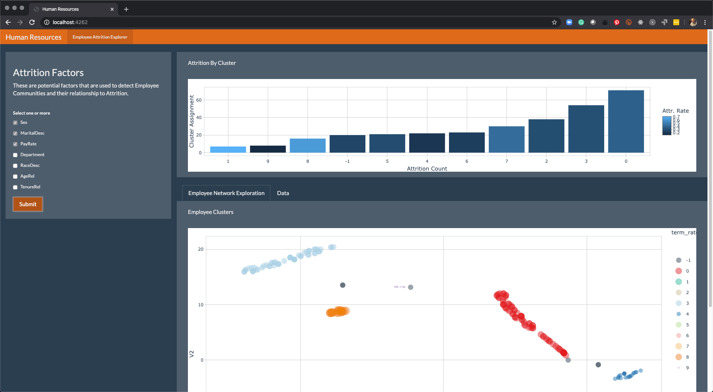

```{r setup, include=FALSE}
knitr::opts_chunk$set(
    echo = TRUE,
    message = FALSE,
    warning = FALSE
)
```


# Prerequisites (Conda py3.8 Environment)

Follow the article, [_"How to Run Python's Scikit-Learn in R in 5 minutes"_](https://www.business-science.io/learn-r/2020/04/20/setup-python-in-r-with-rmarkdown.html)

- Install the Anaconda Distribution

- Get Python Scikit Learn Setup in R

- Make "py3.8" conda environment with `scikit-learn`, `numpy`, `pandas` and `matplotlib`.

# Setup R's Python interface

```{r}
library(reticulate)

# Replace this with your conda environment containing sklearn, pandas, & numpy
use_condaenv("py3.8", required = TRUE)
```


# Data Wrangling & Preprocessing (R)

```{r}
library(tidyverse)
library(lubridate)
```


## Data Ingest

```{r}
hr_data_tbl <- read_csv("data/HRDataset_v13.csv")

hr_data_tbl
```

```{r, eval=F}
hr_data_tbl %>% glimpse()
```

## Age and Tenure Features

```{r}
hr_data_tbl <- hr_data_tbl %>%
    mutate(AgeRel    = ( mdy(DOB) - min(mdy(DOB), na.rm = TRUE) ) / dyears(1)) %>%
    mutate(TenureRel = ( mdy(DateofHire) - min(mdy(DateofHire), na.rm = TRUE) ) / dyears(1))

hr_data_tbl %>% select(AgeRel, TenureRel)

hr_data_tbl %>%
    ggplot(aes(AgeRel)) +
    geom_histogram()
```


## Subset & Fix Missingness

```{r}
library(DataExplorer)
```


```{r}
hr_data_tbl %>% plot_missing()
```

```{r}
selections <- c(
    "Employee_Name", 
    "Sex", "MaritalDesc", 
    "PayRate", "Department",
    "AgeRel"
    )

hr_subset_tbl <- hr_data_tbl %>%
    select(one_of(selections)) %>%
    drop_na()

hr_subset_tbl %>% glimpse()
```

```{r}
hr_subset_tbl %>% plot_missing()
```


## Preprocessing (recipes)

```{r, paged.print = FALSE}
library(recipes)

rec_obj <- recipe(~ ., hr_subset_tbl) %>%
    step_rm(Employee_Name) %>%
    step_normalize(all_numeric()) %>%
    step_dummy(all_nominal(), one_hot = FALSE) %>%
    prep()
    
rec_obj
```

```{r}
hr_subset_processed_tbl <- juice(rec_obj)

hr_subset_processed_tbl %>% glimpse()
```

```{r}
hr_subset_processed_tbl %>%
    ggplot(aes(AgeRel)) +
    geom_histogram()
```

```{r}
# Prep for Python
X              <- as.matrix(hr_subset_processed_tbl)
employee_names <- hr_subset_tbl$Employee_Name
```

# Machine Learning (Python)

## Clustering - Python

```{python}
# Data Manipulation
import pandas as pd
import numpy as np
```

### R to Python

```{python}
r.X
```

```{python}
r.hr_subset_processed_tbl
```


```{python}
pd.Series(r.employee_names)
```

### Affinity Propagation

```{python}
# Machine Learning
from sklearn.cluster import AffinityPropagation
```


```{python}
af = AffinityPropagation().fit(r.X)
af
```

```{python}
af.cluster_centers_indices_
```


```{python}
cluster_assignments_af = af.labels_
cluster_assignments_af
```

### DBSCAN

```{python}
from sklearn.cluster import DBSCAN
```

```{python}
db = DBSCAN(min_samples=5).fit(r.X)
db
```

```{python}
cluster_assignments_db = db.labels_
cluster_assignments_db
```


## TSNE Low-Dimensional Embedding - Python

Needed to create a reduced representation of the original data in 2-D space.

```{python}
from sklearn.manifold import TSNE
```

```{python}
X_embedded = TSNE(n_components=2, random_state=123).fit_transform(r.X)

pd.DataFrame(X_embedded)
```

# Py to R

### Getting Scikit-Learn Results in RMarkdown

```{r}
# Affinity Propogation
py$cluster_assignments_af
```

```{r}
# DBSCAN
py$cluster_assignments_db
```

```{r}
X_embedded_tbl <- py$X_embedded %>% as_tibble()
X_embedded_tbl
```

# Visualizations (R)

```{r}
library(plotly)
library(tidyquant)
```

## Data Preparation

```{r}
employee_clustering_tbl <- tibble(
    Employee_Name = employee_names,
    cluster_af    = py$cluster_assignments_af,
    cluster_db    = py$cluster_assignments_db,
) %>%
    bind_cols(X_embedded_tbl) %>%
    left_join(hr_data_tbl)

employee_clustering_tbl
```


```{r}
attrition_rate_tbl <- employee_clustering_tbl %>%
    select(cluster_db, Termd) %>%
    group_by(cluster_db) %>%
    summarise(
        term_rate  = sum(Termd) / length(Termd),
        term_count = n()
    ) %>%
    arrange(desc(term_rate))

attrition_rate_tbl
```


## Attrition by Cluster Visualization

```{r}
g <- attrition_rate_tbl %>%
    mutate(cluster_db = as_factor(cluster_db) %>% fct_reorder(term_count)) %>%
    ggplot(aes(term_count, cluster_db)) +
    geom_col(aes(fill = term_rate)) +
    theme_tq() +
    labs(title = "Attrition Rate by Employee Cluster",
         fill = "Attr. Rate", x = "Attrition Count", y = "Cluster Assignment")

ggplotly(g)
```

## Cluster Network Visualization - R

```{r}
data_formatted <- employee_clustering_tbl %>%
    left_join(attrition_rate_tbl) %>%
    mutate(description = str_glue("{Employee_Name}
                                  Position = {Position}
                                  MaritalDesc = {MaritalDesc}
                                  Sex = {Sex}
                                  Race = {RaceDesc}
                                  EmpStatusID = {EmpStatusID}
                                  PayRate = {PayRate}
                                  Terminated = {Termd}
                                  Term Reason = {TermReason}
                                  
                                  Cluster Term Rate: {scales::percent(term_rate)}
                                  Cluster Term Count: {term_count}
                                  
                                  ")
    ) %>%
    select(Employee_Name:V2, description, Termd, 
           term_rate, term_count)

g <- data_formatted %>%
    
    ggplot(aes(V1, V2, color = factor(cluster_db))) +
    geom_point(aes(text = description, size = term_rate), alpha = 0.5) +
    scale_color_tq() +
    theme_tq() +
    # theme(legend.position = "none") + 
    labs(title = "Employee Cluster Assignments", color = "Cluster")
    

ggplotly(g)
```


# Shiny App

## Sourcing Python

```{r}
# Bonus #1!!!
source_python("py/clustering.py")
source_python("py/tsne.py")
```

```{r}
# Calls def cluster_dbscan() 
cluster_dbscan(X)
```

```{r}
# calls def tsne_embedding()
tsne_embedding(X) %>% head()
```

## Integrate into Shiny App!

```{r}
# Bonus #2!!!

```

